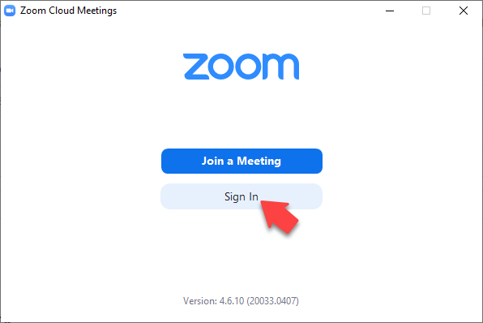
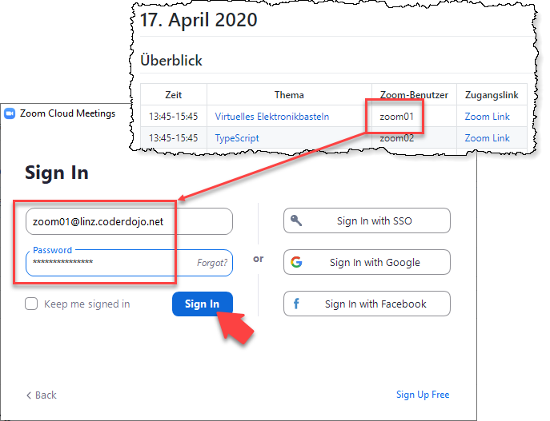
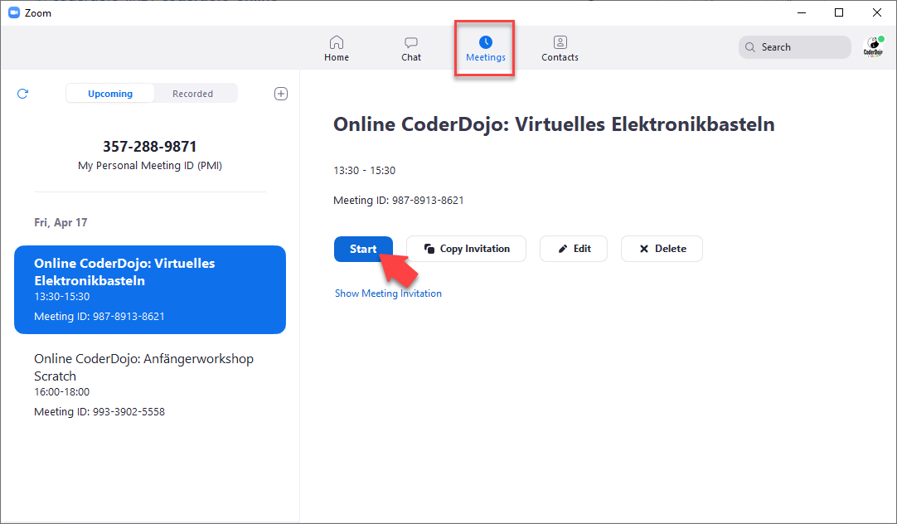

# Nutzung von Zoom

## Einleitung

Wir nutzen für die Online CoderDojos die [Zoom](https://zoom.us)-Plattform.

## Generische Benutzer

Da bei jedem CoderDojo andere Personen Hosts für die Meetings sind, haben wir vier generische Zoom-Benutzer angelegt. Diese heißen *zoom01@linz.coderdojo.net*, *zoom02@linz.coderdojo.net*, *zoom03@linz.coderdojo.net* und *zoom04@linz.coderdojo.net*. Der Benutzer *zoom01@linz.coderdojo.net* ist der Administrator unseres Zoom-Accounts.

Die Passwörter für die zuvor genannten Zoom-Benutzer können bei Rainer erfragt werden.

## Meetings

Wenn ihr als Host das Meeting starten wollt, startet Zoom bitte über das Windows Startmenü und meldet euch mit dem jeweiligen Benutzer an (Benutzerauswahl siehe nächster Absatz):

Jedem Workshop im Online CoderDojo wird ein zoom-Benutzer (z.B. *zoom01*) zugeordnet. Einer der Hosts für den Workshop steigt **mit diesem Benutzer** in den Zoom-Client ein und kann damit das Meeting starten.

Wenn ihr angemeldet seid, könnt ihr das Zoom Meeting starten:

Optional kann man danach einem anderen Benutzer (z.B. persönlichem Zoom-Benutzer) die *Host*-Rechte geben. **Achtung:** Auch wenn die Host-Rechte übergeben wurden, wird der ursprüngliche Benutzer dadurch nicht "frei". Er kann *kein* andere Meeting starten, ohne das ursprüngliche Meeting zuvor beenden zu müssen.

Beim Anlegen von Online CoderDojo Zoom Meetings könnt ihr optional die jeweils anderen Zoom-Benutzer als *alternative Hosts* eintragen. Wenn man also z.B. ein Meeting mit *zoom01* anlegt, kann man *zoom02* bis *zoom04* als alternative Hosts eintragen.

## Einschränkungen

Wir haben momentan vier Zoom-Hosts. Das heißt, dass maximal vier Zoom-Meetings gleichzeitig laufen können.
